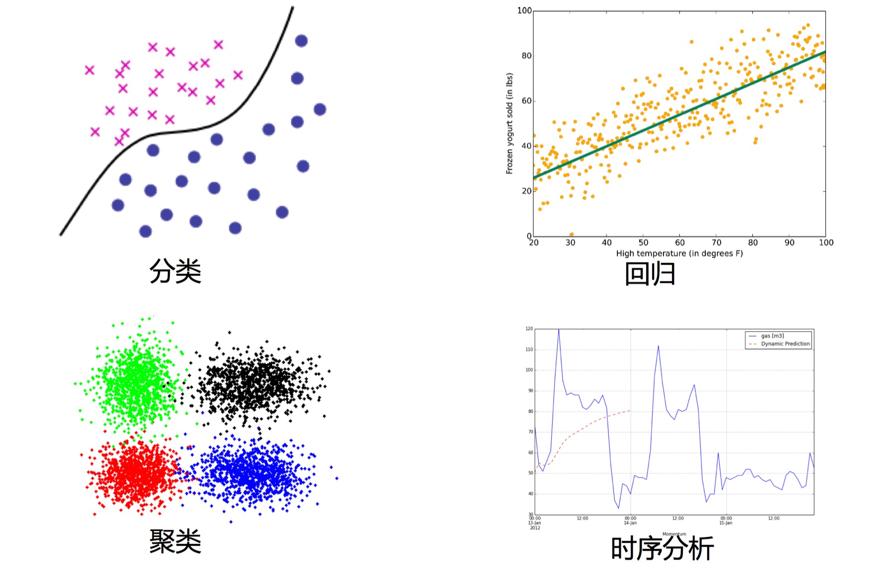

## 一 数据分析简介

数据分析：通过对大量数据进行分析，得出一些结论、规律，以便用于生产、生活、商业。  

数据分析的流程：提出问题-->收集数据-->分析数据-->获得结论-->可视化成果

## 二 数据工程领域中的DIKW体系

- D：Data (数据)，是 DIKW 体系中最低级的材料，一般指原始数据，包含（或不包含）有用的信息。
- I：Information (信息)，作为一个概念，信息有着多种多样的含义。在数据工程里，表示由数据工程师（使用相关工具）或者 数据科学家（使用数学方法），按照某种特定规则，对原始数据进行整合提取后，找出来的更高层数据（具体数据）。
- K：Knowledge (知识)，是对某个主题的确定认识，并且这些认识拥有潜在的能力为特定目的而使用。在数据工程里，表示对信息进行针对性的实用化，让提取的信息可以用于商业应用或学术研究。
- W：Wisdom (智慧)，表示对知识进行独立的思考分析，得出的某些结论。在数据工程里，工程师和科学家做了大量的工作用计算机程序尽可能多地提取了价值（I/K），然而真正要从数据中洞察出更高的价值，甚至能够对未来的情况进行预测，则需要数据分析师。

## 三 数据分析工具

数据分析平台：
- SAS：SAS（STATISTICAL ANALYSIS SYSTEM，简称SAS）公司开发的统计分析软件，是一个功能强大的数据库整合平台。价格昂贵，银行或者大企业才买的起，做离线的分析或者模型用。
- SPSS：SPSS（Statistical Product and Service Solutions，统计产品与服务解决方案）是IBM公司推出的一系列用于统计学分析运算、数据挖掘、预测分析和决策支持任务的产品，迄今已有40余年的成长历史，价格昂贵。

数据分析开发语言：
- R/MATLAB：适合做学术性质的数据分析，在实际应用上需要额外转换为Python或Scala来实现，而且MATLAB（MathWorks公司出品的商业数学软件）是收费的。
- Scala：是一门函数式编程语言，熟练使用后开发效率较高，配合Spark适合大规模的数据分析和处理，Scala的运行环境是JVM。
- Python：Python在数据工程领域和机器学习领域有很多成熟的框架和算法库，完全可以只用Python就可以构建以数据为中心的应用程序。在数据工程领域和机器学习领域，Python非常非常流行。

## 四 数据建模

#### 4.1 大数据分析场景和模型应用

数据分析建模需要先明确业务需求，然后选择是 描述型分析 还是 预测型分析：
- 如果分析的目的是描述目标行为模式，就采用描述型数据分析，描述型分析就考虑 关联规则、 序列规则 、 聚类 等模型。
- 如果是预测型数据分析，就是量化未来一段时间内，某个事件的发生概率。有两大预测分析模型， 分类预测 和 回归预测。

#### 4.2 常见的数据建模分类

  

**分类**：  
    - 介绍：是通过已有的训练样本去训练得到一个最优模型，再利用这个模型将输入映射为相应的输出，对输出进行简单的判断从而实现分类的目的，也就具有了对未知数据进行分类的能力。  
    - 原理：将数据映射到 预先定义的 群组或类。算法要求基于数据 特征值 来定义类别，把具有某些特征的数据项映射到给定的某个类别上。分类并没有逼近的概念，最终正确结果只有一个。 在机器学习方法里，分类属于监督学习。
    - 模型：采用 离散预测值

**回归**：  
    - 介绍：是基于观测数据建立变量间适当的依赖关系，以分析数据内在的规律，得到响应的判断。并可用于预报、控制等问题。  
    - 原理：用属性的 历史数据 预测未来趋势。算法首先假设一些已知类型的函数可以匹配目标数据，然后分析匹配后的误差，确定一个与目标数据匹配程度最好的函数。回归是对真实值的一种 逼近预测。
    - 模型：采用 连续的预测值

分类与回归应用：信用卡申请人风险评估、预测公司业务增长量、预测房价，未来的天气情况。   

**聚类**：
    - 介绍：将相似的事物聚集在一起，不相似的事物划分到不同的类别的过程
    - 聚类分析：又称群分析，它是研究（样品或指标）分类问题的一种统计分析方法，同时也是数据挖掘的一个重要算法。
    - 原理：在没有给定划分类的情况下，根据信息相似度进行信息聚类，聚类的输入是一组 未被标记的数据，根据样本特征的距离或相似度进行划分。划分原则是保持最大的组内相似性和最小的组间相似性。不同于分类，聚类事先 没有任何训练样本，直接对数据进行建模。聚类分析的目标，就是在相似的基础上收集数据来分类。 在机器学习方法里，聚类属于无监督学习。
    - 应用：根据症状归纳特定疾病、发现信用卡高级用户、根据上网行为对客户分群从而进行精确营销等

**时序模型**：
    - 介绍：不管在哪个领域中（如金融学、经济学、生态学、神经科学、物理学等），时间序列（time series）数据都是一种重要的结构化数据形式。在多个时间点观察或测量到的任何事物，都可以形成一段时间序列。时间序列大多都是固定频率的，数据点将根据某种规律定期出现。
    - 原理：描述 基于时间或其他序列的 经常发生的规律或趋势，并对其建模。 与回归一样，用已知的数据预测未来的值，但这些数据的区别是 变量所处时间的不同。重点考察数据之间在 时间维度上的关联性。
    - 应用：下个季度的商品销量或库存量是多少？明天用电量是多少？今天的北京地铁13号线的人流情况？

## 五 常见的数据分析应用场景如下

市场营销：
  - 营销响应分析建模(逻辑回归，决策树)
  - 净提升度分析建模(关联规则)
  - 客户保有分析建模(卡普兰梅尔分析，神经网络)
  - 购物车分析(关联分析Apriori)
  - 自动推荐系统(协同过滤推荐，基于内容推荐，基于人口统计推荐，基于知识推荐，组合推荐，关联规则)
  - 客户细分(聚类)
  - 流失预测(逻辑回归)

风险管理：
  - 客户信用风险评分(SVM，决策树，神经网络)
  - 市场风险评分建模(逻辑回归和决策树)
  - 运营风险评分建模(SVM)
  - 欺诈检测(决策树，聚类，社交网络)

